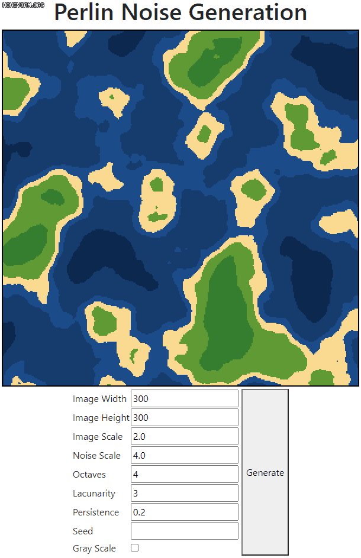

# Perlin Noise Generation

[Perlin noise](https://en.wikipedia.org/wiki/Perlin_noise) generation algorithm implemented in html5/js.  

Video: https://youtu.be/CueTiJTNLIk

You can play with parameters!  
Live demo: https://sopiro.github.io/Perlin-Noise-Generation/  

## Preview

